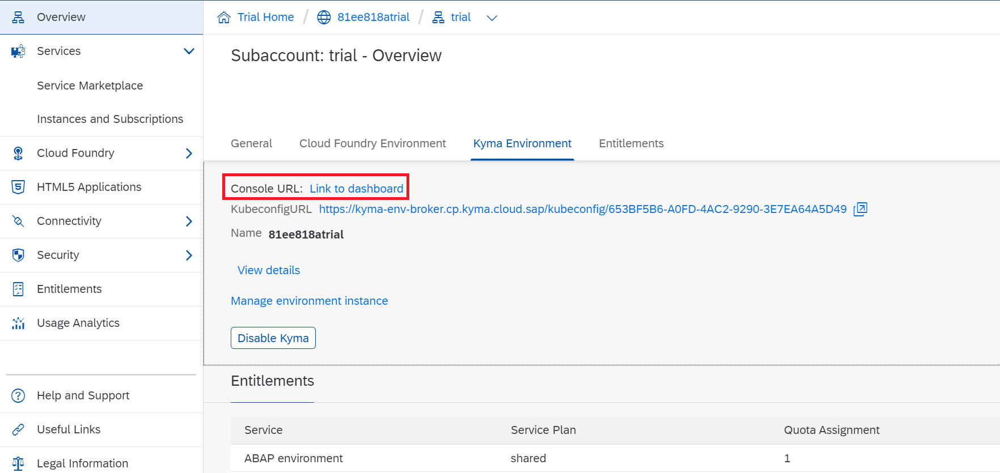
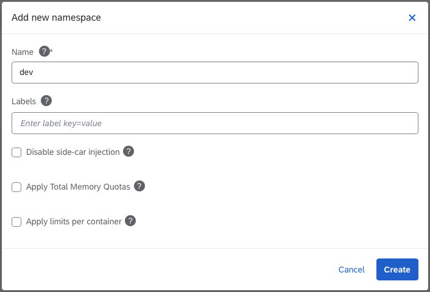
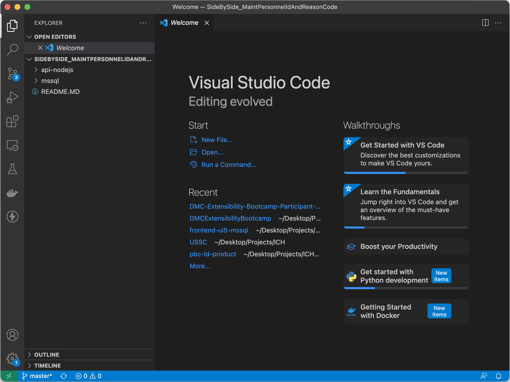
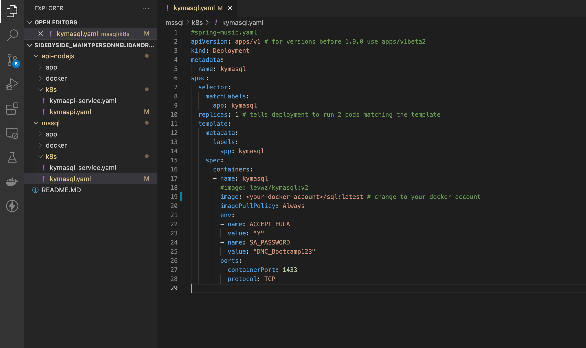
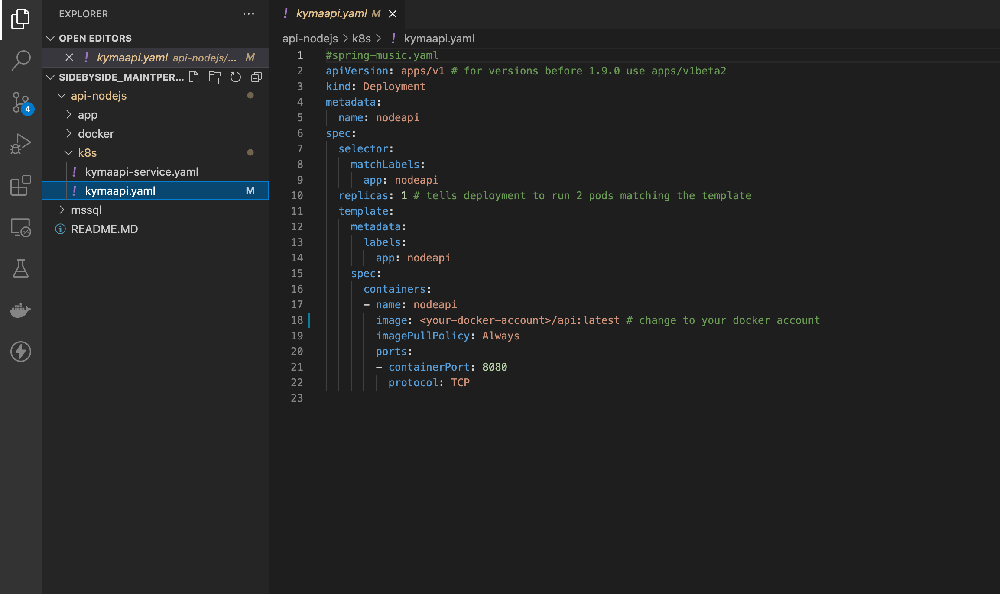
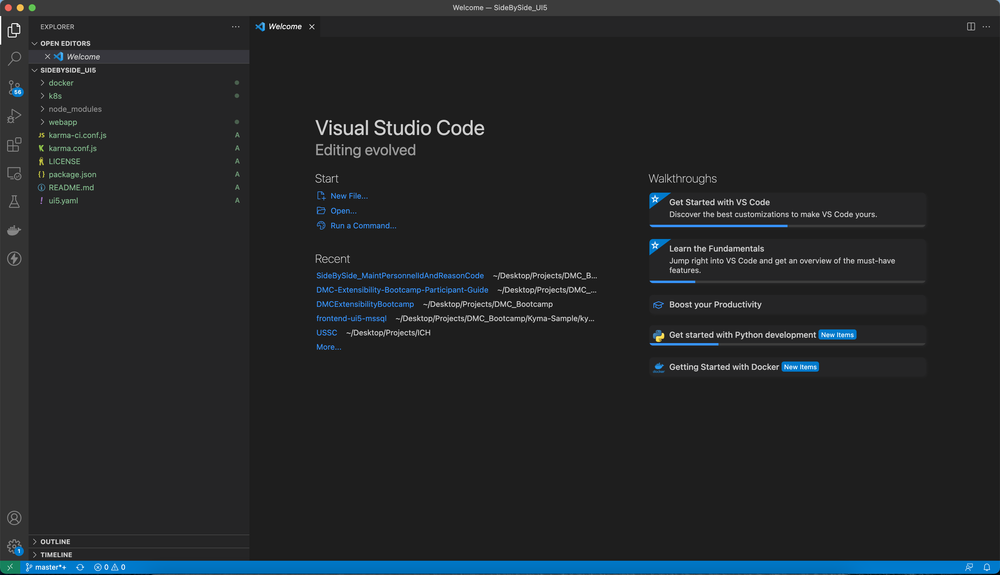
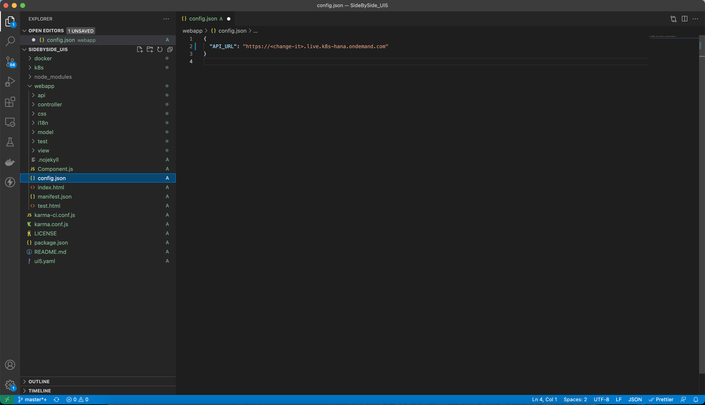
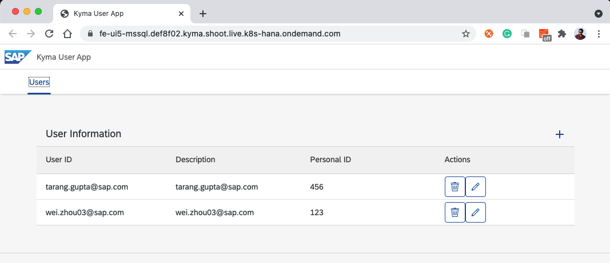

# Exercise 4.1 - Side by side Extension

In this exercise, we would like to show you how to write your own side by side extension and exposed as an API and UI5 application using mssql DB in the SAP BTP, Kyma Runtime.

# Prerequisites

- SAP BTP, Kyma runtime instance
- [Docker](https://www.docker.com/)
- [Node.js](https://nodejs.org/en/)
- [UI5 Tooling](https://sap.github.io/ui5-tooling/)
- [kubectl](https://kubernetes.io/docs/tasks/tools/install-kubectl/) configured to use the ```KUBECONFIG``` file downloaded from the Kyma runtime.

## Step 1: Build your own business application
1. Access to your Kyma Dashboard.


2. Under the "Namespaces" section, click the "Create Namespace" button to create a new namespace. 


3. Enter the name of your namespace, e.g dev.


4. Under the "Namespaces" section, select the newly created namespace to access that.


5. Download the sample code from [DM Extensibility Bootcamp Github Samples](https://github.com/SAP-samples/digital-manufacturing-extension-samples/tree/main/dm-sidebyside-extension/SideBySide_MaintPersonnelIdAndReasonCode).

6. Open the folder "SideBySide_MaintPersonnelIdAndReasonCode" which is under "dm-sidebyside-extension" in the Visual Studio Code.


7. Build and push the image to your Docker repository. (optional)

    Build Process for SQL(Inside folder ***mssql***):
		
            docker build -t {your-docker-account}/mssql -f docker/Dockerfile .

            docker push {your-docker-account}/mssql

    Build Process for API(Inside folder ***api-nodejs***):
        
            docker build -t {your-docker-account}/api -f docker/Dockerfile .
        
            docker push {your-docker-account}/api


8. Replace the image name with your docker account in the respective ***/k8s*** folder. (optional)

    Inside folder ***mssql*** (kymasql.yaml):
        

    Inside folder ***api-nodejs*** (kymaapi.yaml)
        

9. Apply the Deployment.

    Inside ***api-nodejs*** folder
    
            kubectl -n dev apply -f ./k8s/kymaapi.yaml

    Inside ***mssql***folder
    
            kubectl -n dev apply -f ./k8s/kymasql.yaml

10. Apply the Service.

    Inside ***api-nodejs*** folder

            kubectl -n dev apply -f ./k8s/kymaapi-service.yaml
        
    Inside ***mssql***folder

            kubectl -n dev apply -f ./k8s/kymasql-service.yaml

11. Verify that the Pod is up and running:

		    kubectl -n dev get po

	The expected result shows that the Pod for the `kymasql and kymaapi` Deployment is running:

            NAME                       READY   STATUS    RESTARTS   AGE
            kymasql-7ddb66fbc-mbvrq    1/1     Running   1          3d20h
            nodeapi-86b76cd99b-hbgf9   1/1     Running   1          3d16h
	
12. In the Kyma Dashboard, go to Discovery and Netowrk > API Rules to create API rule for this service.


13. Enter the name (e.g nodeapi) and Subdomain name (e.g nodeapi) to create API rule.


14. To test the API, you can use Postman to send a POST request to `http://<API_URL>/api/v1/users` with the below sample JSON content in the body.

		{
            "recordsets": [[{"userId": "tarang.gupta@sap.com","description": "tarang.gupta@sap.com","personalId": "456"}, {"userId": "wei.zhou03@sap.com","description": "wei.zhou03@sap.com","personalId": "123"}]],
            "recordset": [{
                "userId": "tarang.gupta@sap.com",
                "description": "tarang.gupta@sap.com",
                "personalId": "456"
            }, {
                "userId": "wei.zhou03@sap.com",
                "description": "wei.zhou03@sap.com",
                "personalId": "123"
            }],
            "output": {},
            "rowsAffected": [2]
        }

## Step 2: Run the Docker image locally (Optional)

1. To run the Docker image locally.

		docker run -e ACCEPT_EULA=Y -e SA_PASSWORD=DMC_Bootcamp123 -p 1433:1433 -p 8080:8080 --name sql -d {your-docker-account}/kymasql

2. To run the database SQL.
		
		docker exec -it sql1 "bash"
		/opt/mssql-tools/bin/sqlcmd -S localhost -U SA -P DMC_Bootcamp123
		>USE BootcampDB SELECT * FROM Users
		>GO
	
	You will see two DB records are returned initially.

3. To test the API locally, you can use Postman to send a POST request to [http://localhost:8080/api/v1/users](http://localhost:8080/api/v1/users) with the below sample JSON content in the body.

		{
            "recordsets": [[{"userId": "tarang.gupta@sap.com","description": "tarang.gupta@sap.com","personalId": "456"}, {"userId": "wei.zhou03@sap.com","description": "wei.zhou03@sap.com","personalId": "123"}]],
            "recordset": [{
                "userId": "tarang.gupta@sap.com",
                "description": "tarang.gupta@sap.com",
                "personalId": "456"
            }, {
                "userId": "wei.zhou03@sap.com",
                "description": "wei.zhou03@sap.com",
                "personalId": "123"
            }],
            "output": {},
            "rowsAffected": [2]
        }


## Step 3: Build UI5 application to consume exposed api

1. Download the sample code from [DMC Extensibility Bootcamp Github Samples](https://github.com/SAP-samples/digital-manufacturing-extension-samples/tree/main/dm-sidebyside-extension/SideBySide_UI5).

2. Open the folder "SideBySide_UI5" which is under "dm-sidebyside-extension" in the Visual Studio Code.
    


### Run the frontend locally (Optional)


1. Inside the directory, run:

    ```npm install```

2. Adjust the value of the **API_URL** parameter in the `webapp/config.js` file to match your `users` API URL.
    

3. To start the application, run:

    ```npm run-script start```

The application loads at `http://localhost:8080`.

### Build the Docker image (optional)

1. Build and push the image to your Docker repository:

            docker build -t {your-docker-account}/fe-ui5-mssql -f docker/Dockerfile .
            docker push {your-docker-account}/fe-ui5-mssql

### Deploy the frontend

1. Within the project open the file `k8s/configmap.yaml` and adjust the `API_URL` by replacing `<cluster domain>` to the match the Kyma runtime cluster domain.

2. Apply the Resources:

    
            kubectl -n dev apply -f ./k8s/configmap.yaml
            kubectl -n dev apply -f ./k8s/deployment.yaml
            kubectl -n dev apply -f ./k8s/apirule.yaml

3. Use the APIRule to open the application:

            https://fe-ui5-mssql.{cluster-domain}



