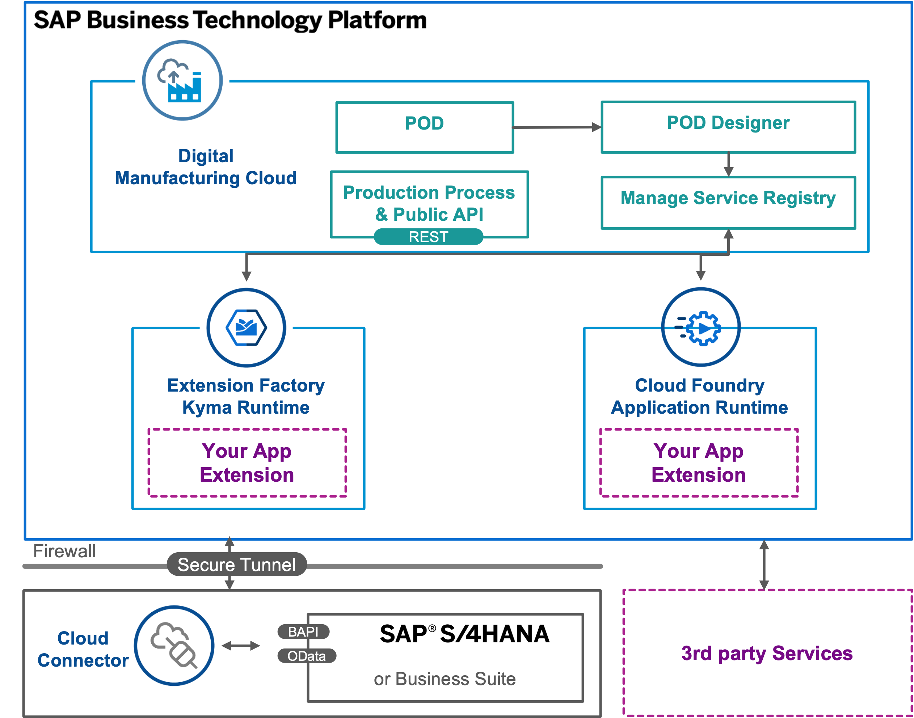

# Unit 6 - Production Operator Dashboard Plugins

## Overview
### PODPlugin Extensions

A plugin is a UI5 component. Components are independent and reusable parts used in SAPUI5 applications. An application can use components from different locations from where the application is running. Thus, components can be developed by different development teams and be used in different projects. Components also support the encapsulation of closely-related parts of an application into a particular component. This makes the structure of an application and its code easier to understand and to maintain.

There are two types of UI5 components:
- Faceless components (sap.ui.core.Component) do not have a user interface and are primarily used to perform transactions to a back-end system. 
- UI components (sap.ui.core.UIComponent) extend components to add rendering functionality to the component.

Considering this, there are also two types of plugins that can be defined to run inside the POD framework.
- Execution plugins are faceless components that primarily execute transactions to a back-end service.
- View plugins are UI components which have a model, view and controller. View plugins are created and rendered in a component container within the POD.

## Learning objectives
- Create a PODPlugin within SAP Business Application Studio
- Build the plugin and Deploy it to Cloud Foundry environment
- Add and Config the PODPlugin in DMC app 'POD Designer'
- Create and deploy an iflow in CPI tenant

## Prerequisites
- You have access to the DMC tenant
- You have access to the subaccount of Cloud Foundry where to build your own plugin
- You have Business Application Studio enabled for your subaccount

## BTP Components
- Cloud Foundry Application runtime
- Business Application Studio

## Architecture
### POD Extensibility

