# Exercise 4.2 - Perform Inspection Operation (2/2)

## Create Custom POD plugin
1. Login into your Application Business Studio
2. Create a pod plugin:
    - Create from scrach (refer [Production Operator Dashboard Plugin Developer's Guide][1])
    - Copy and modify from SAP [samples](../dm-ui-extensions/ViewPodPluginTemplate_And_Example/project/ViewPodPlugin/)
    - Using the finished [sample](../dm-ui-extensions/PodPlugin_CustomScrapConfirmation) to skip the below section **Modify the content**
3. Download the samples and extract it.
4. Go back to Applicaton Business Studio, and select 'Terminal' from menu and click 'New Terminal'
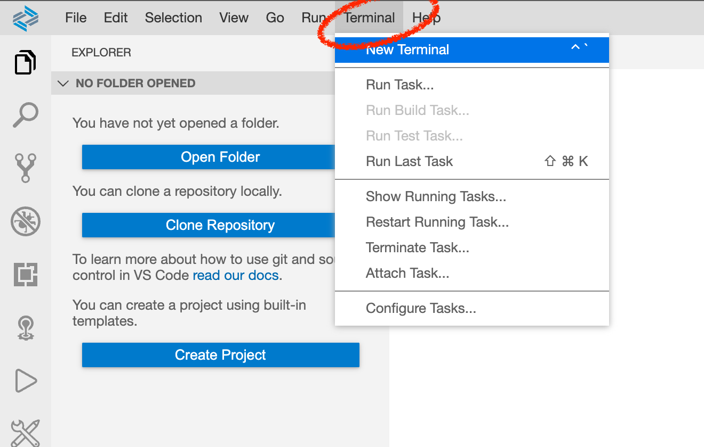
5. Create folder under directory /user/projects
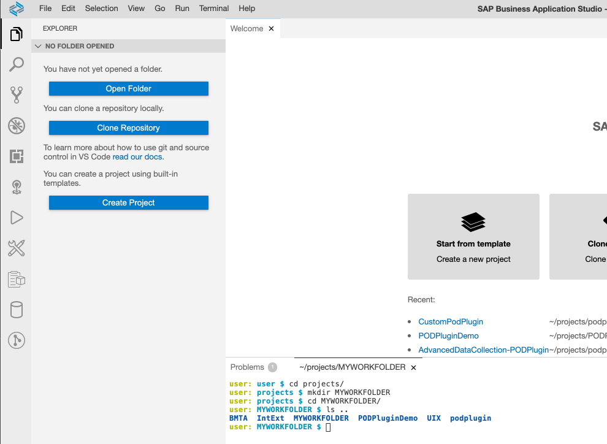
6. Open the folder you just created, and drag the content in step 3 into your Business Application Studio, then wait for the upload complete
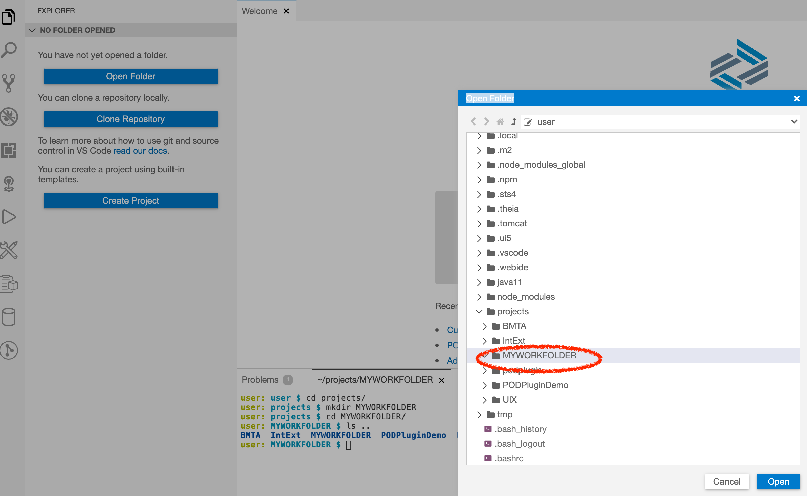


7. Expand the root folder, the structure will look like below
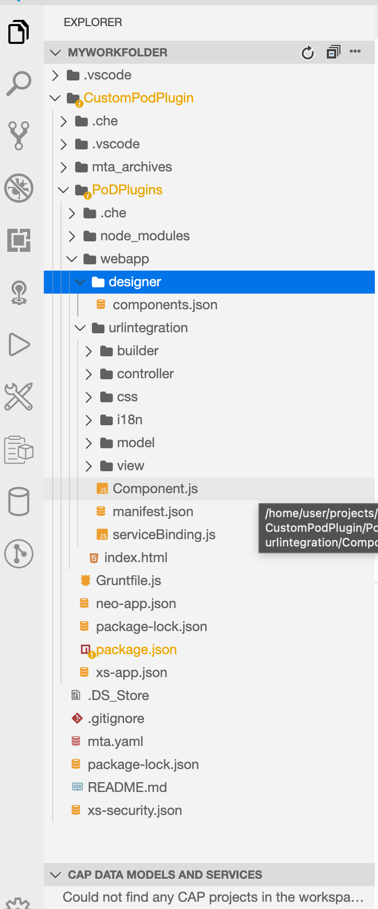
8. Right click the mta.yaml and select 'Build MTA Project', verify that the terminal output make sure you see highlighted
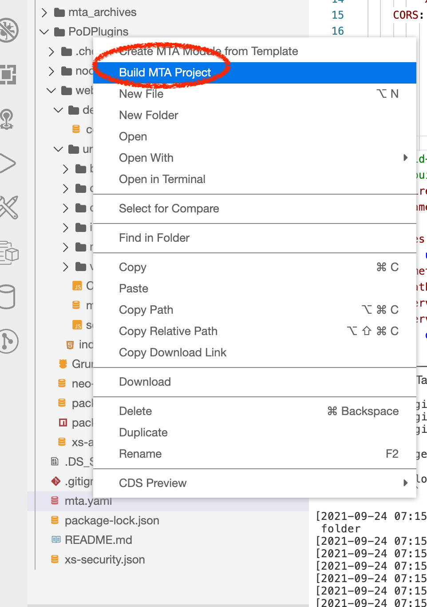
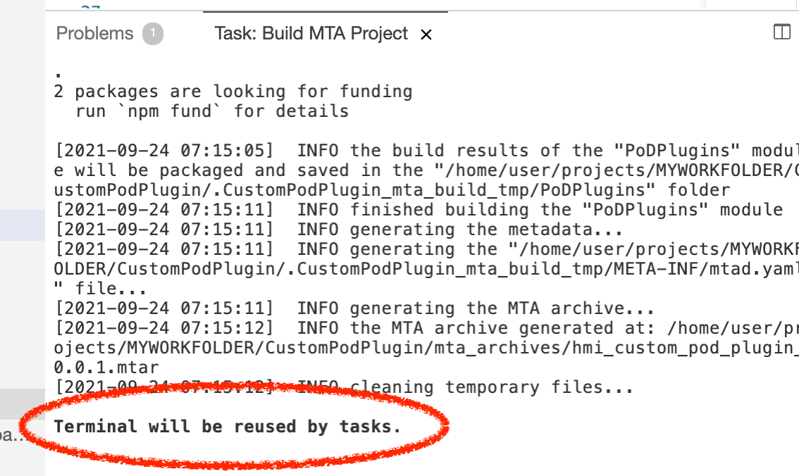

## Modify the content (Optional)

1. Navigate to folder urlintegraion, and open manifest.json, if you renamed the urlintegration folder, do a global replace with sap.custom.plugins.urlintegration --> sap.custom.plugins.{yournewname}.{yournewname} will be good enough.
```
Files list:
./PoDPlugins/webapp/designer/components.json
./PoDPlugins/webapp/integrationextension/Component.js
./PoDPlugins/webapp/integrationextension/manifest.json
./PoDPlugins/webapp/integrationextension/builder/PropertyEditor.js
./PoDPlugins/webapp/integrationextension/controller/MainView.controller.js
./PoDPlugins/webapp/integrationextension/view/MainView.view.xml

```
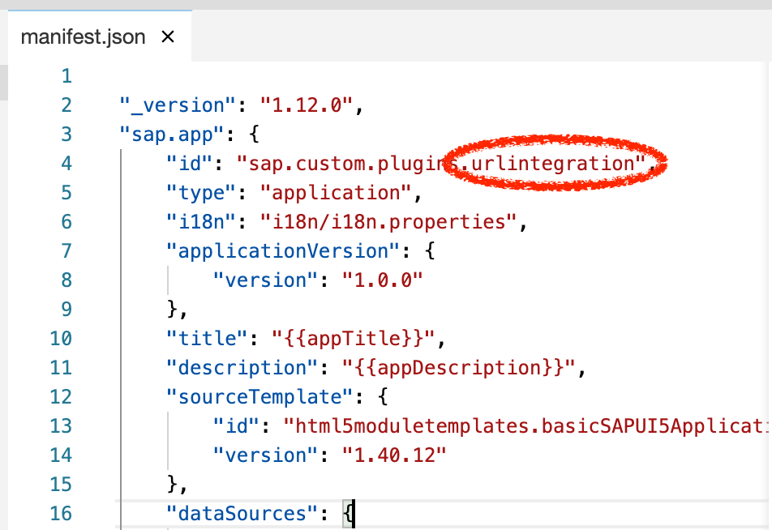

2. Edit the 'title' in i18n.properties and builder.properties to rename your application
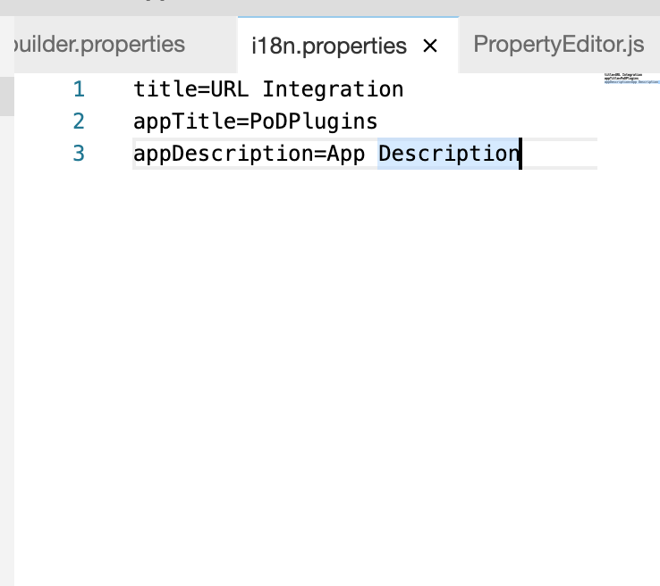
3. Modify the components.json in designer to change what kind of PODs your plugin can be selected.
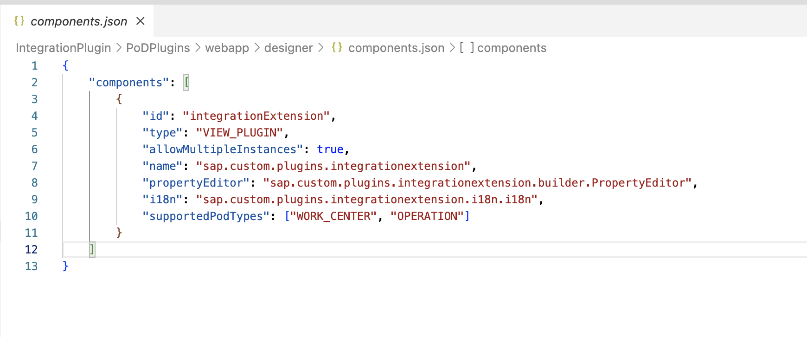
4. Modify the PropertyEditor.js to define the properties can be configured in POD designer
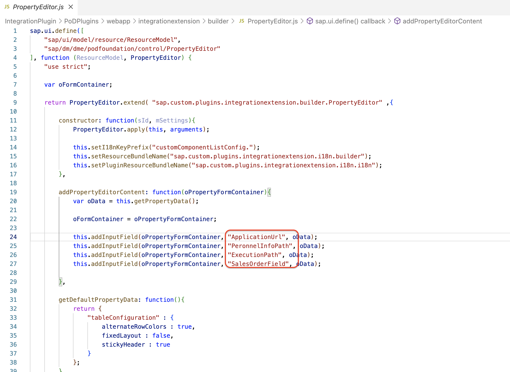
5. Edit the MainView.view.xml in view and MainView.controller.js in controller to implement your logic
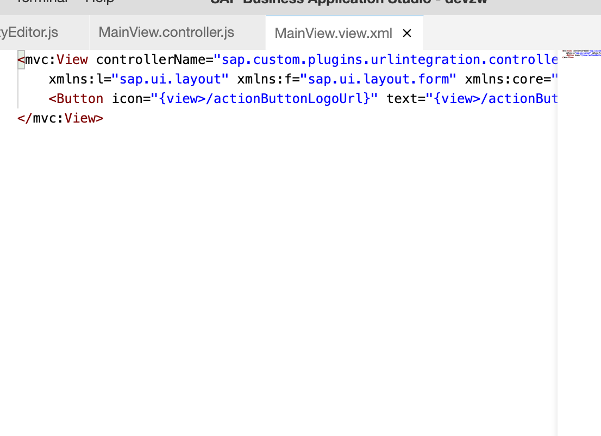
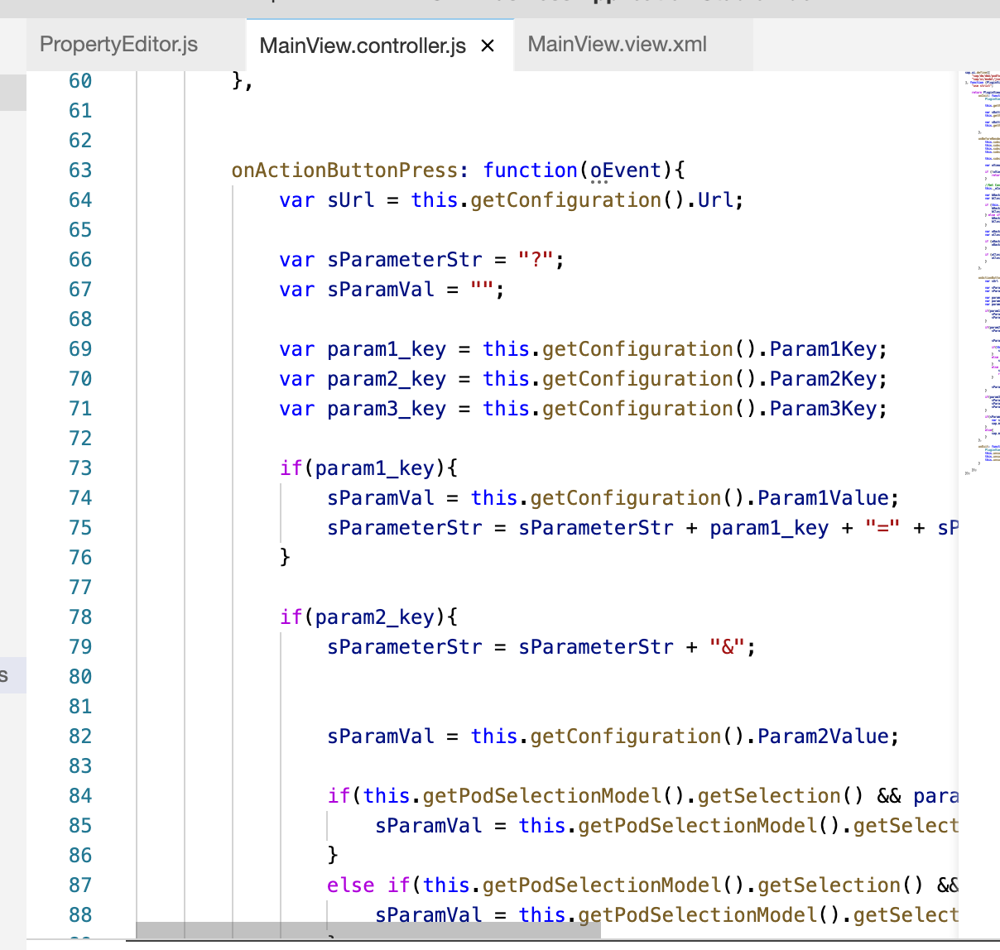
6. In my sample, I renamed the application title to 'Shopfloor Extension' in i18.properties and builder.properties, and renamed the urlintegration folder to integrationextension, make ui changes in MainView.view.xml and MainView.controller.js and properties defination in PropertyEditor.js
```properties
title=Shopfloor Extension
appTitle=PoDPlugins
appDescription=App Description
```
```xml
<mvc:View controllerName="sap.custom.plugins.integrationextension.integrationextension.controller.MainView" xmlns:mvc="sap.ui.core.mvc" xmlns="sap.m"
	xmlns:l="sap.ui.layout" xmlns:f="sap.ui.layout.form" xmlns:core="sap.ui.core" class="viewBackground">
	<Panel id="dcEntryViewPanel" width="100%" height="100%" accessibleRole="Region" backgroundDesign="Transparent" class="sapUiNoContentPadding">

    <content>

    <l:HorizontalLayout>
      <Table noDataText="Drop column list items here and columns in the area above" id="table0">
          <columns>

              <Column id="column0">
                  <header>
                      <Label text="Ext. Confirmation Fields" id="label0"/>
                  </header>
              </Column>
              <Column id="column1">
                  <header>
                      <Label text="Ext. Confirmation Value" id="label1"/>
                  </header>
              </Column>
          </columns>
          <items>
          <!-- ColumnListItem type="Active" id="item00">
                      <Label text="Sfc number"/>
                      <Input id="SFCID" editable="false" />
            </ColumnListItem -->
            <ColumnListItem type="Active" id="item0">
                      <Label text="Reason code"/>
                      <ComboBox id="REASONCODE" editable="true" >
                        <core:Item key="0001" text="Machine malfunction" />
                        <core:Item key="0002" text="Operating error" />
                        <core:Item key="0003" text="Defective material" />
                      </ComboBox>
            </ColumnListItem>
              <ColumnListItem type="Active" id="item1">
                      <Label text="Personnel number"/>
                      <Input id="PERSONNELNUM" editable="true" />
              </ColumnListItem>
              <ColumnListItem type="Active" id="item2">
                      <Label text="Shop Order"/>
                      <Input id="SHOPORDER" editable="false" />
              </ColumnListItem>
               <ColumnListItem type="Active" id="item3">
                      <Label text="Sales Order"/>
                      <Input id="SALESORDER" editable="false" />
              </ColumnListItem>

            
          </items>
    </Table>
      </l:HorizontalLayout>
   
  </content>
  </Panel>
  <Bar>
			
        <contentRight>
        <Button type="Accept" text="Save Context" press="onActionButtonPress" >
            
        </Button>
        <Button type="Accept" text="Get SFC Details " press="onGetDetailsButtonPress" >
            
        </Button>
        </contentRight>
 </Bar>
</mvc:View>
```
```js
sap.ui.define([
    "sap/dm/dme/podfoundation/controller/PluginViewController",
    "sap/ui/model/json/JSONModel",
    "sap/m/MessageToast"
], function (PluginViewController, JSONModel, MessageToast) {
    "use strict";

    return PluginViewController.extend("sap.custom.plugins.integrationextension.integrationextension.controller.MainView", {
        onInit: function () {
            PluginViewController.prototype.onInit.apply(this, arguments);

            this.getView().setModel(new JSONModel(), "view");

        },

        onBeforeRenderingPlugin: function () {
            console.log("onBeforeRenderingPlugin in");
            this.subscribe("WorklistSelectEvent", this._onWorklistSelectEvent, this);
            //this.subscribe("PodSelectionChangeEvent", this._onPodSelectionChangeEvent, this);
            // this.subscribe("OperationListSelectEvent", this._onOperationListSelectEvent, this);
            //this.subscribe("OperationChangeEvent", this._onOperationChangeEvent, this);
            //this.subscribe("WorklistRefreshEvent", this._onWorklistRefreshEvent, this);
            
            var oView = this.getView();

            if (!oView) {
                return;
            }

            //Get Configuration Data
            this._oConfiuration = this.getConfiguration();

            var bBackVisible = true;
            var bCloseVisible = true;

            if (this.isPopup() || this.isDefaultPlugin()) {
                bBackVisible = false;
                bCloseVisible = false;
            } else if (this._oConfiuration) {
                bBackVisible = this._oConfiuration.async;
                bCloseVisible = this._oConfiuration.logLevel;
            }

            var oBackButton = oView.byId("backButton");
            var oCloseButton = oView.byId("closeButton");

            if (oBackButton) {
                oBackButton.setVisible(bBackVisible);
            }

            if (oCloseButton) {
                oCloseButton.setVisible(bCloseVisible);
            }


        },
        updateOrderInfo: function(oEvent){
            if(this.getPodSelectionModel().getSelection() ==null){
                return;
            }
            var shopOrder = this.getPodSelectionModel().getSelection().getShopOrder();
            if (shopOrder != null){
                this.getView().byId("SHOPORDER").setValue(shopOrder.shopOrder);

                var url = this._oPodController.getPublicApiRestDataSourceUri()+'/order/v1/orders?order=' +shopOrder.shopOrder+ '&plant=' + plant;
                var that=this;
                this._oPodController.ajaxGetRequest(url, null,
                    function (oResponseData) {
                        if (oResponseData["customValues"] !=null){
                            var values = oResponseData["customValues"];
                            that.getView().byId("SALESORDER").setValue('');
                            for (var i =0 ; i <values.length; i++){
                                if(values[i]["attribute"]==that.getConfiguration().SalesOrderField){
                                    that.getView().byId("SALESORDER").setValue(values[i]["value"]);
                                    break;
                                }
                            }
                        }                   
                    
                },
                function (oError, sHttpErrorMessage) {
                    var err = oError || sHttpErrorMessage;
                }
                );
            }
        },
        updatePersonnelId: function(oEvent){
            var persUrl = this.getConfiguration().ApplicationUrl+ "/"
             + this.getConfiguration().PeronnelInfoPath + "/"
             + sap.ushell.Container.getService("UserInfo").getUser().getEmail();
             var that =this;
             this.ajaxGetRequest(persUrl, null,
                    function (oResponseData) {
                        if (oResponseData["personalId"] !=null){           //response data format:  { 'personnelId':'123', ... }
                            var value = oResponseData["personalId"];
                            if(value != null){
                                that.getView().byId("PERSONNELNUM").setValue(value);
                                console.log("personnel number is: " + value)
                            }
                        }                   
                },
                function (oError, sHttpErrorMessage) {
                    var err = oError || sHttpErrorMessage;
                    console.error("error is: "+err);
                }
                );
            

        },

        onInit: function(){
            PluginViewController.prototype.onInit.apply(this, arguments);

            console.log('onInit in');
            this.updatePersonnelId(null);
            this.updateOrderInfo(null);            
            console.log('onInit leave');
        },

        _onWorklistSelectEvent: function(oEvent){
            console.log('_onWorklistSelectEvent in');
            this.updateOrderInfo(oEvent);
            console.log('_onWorklistSelectEvent leave');
           
        },
        onGetDetailsButtonPress: function(oEvent){
             if(this.getPodSelectionModel().getSelection() ==null){
                return;
            }
            var shopOrder = this.getPodSelectionModel().getSelection().getShopOrder();
            if (shopOrder != null){
                this.getView().byId("SHOPORDER").setValue(shopOrder.shopOrder);

                var url = this._oPodController.getPublicApiRestDataSourceUri()+'/sfc/v1/sfcdetail?plant=' + plant + '&sfc=' + this.getPodSelectionModel().getSelection().getSfc().sfc;
                var that=this;
                this._oPodController.ajaxGetRequest(url, null,
                    function (oResponseData) {
                        console.log(oResponseData);
                    
                },
                function (oError, sHttpErrorMessage) {
                    var err = oError || sHttpErrorMessage;
                }
                );
            }
        },

        onActionButtonPress: function (oEvent) {
            
             var ppUrl = this.getConfiguration().ApplicationUrl+ "/"
             + this.getConfiguration().ExecutionPath;
                
            this.ajaxPostRequest(ppUrl, {
                    "sfc": "SFC:"+ this.getPodSelectionModel().getSelection().getSfc().sfc,
                    "personnelId": this.getView().byId("PERSONNELNUM").getValue(),
                    "varianceReasonCode": this.getView().byId("REASONCODE").getSelectedKey()
                
            },
                function (oResponseData) {
                    if (oResponseData["error"] != null) {
                        MessageToast.show("Failed on saving Personnel No. and Variance Reason code.");
                    } else {
                        MessageToast.show("Personnel number and Variance Reason Code confirmed.");
                    }
                }.bind(this),

                function (oError, sHttpErrorMessage) {
                    MessageToast.show(sHttpErrorMessage);
                }.bind(this)
            );

           
        },

        onExit: function () {
            PluginViewController.prototype.onExit.apply(this, arguments);
            this.unsubscribe("WorklistSelectEvent", this._onWorklistSelectEvent, this);
            //this.unsubscribe("PodSelectionChangeEvent", this._onPodSelectionChangeEvent, this);
        }

    });
});
```

## Build and Deploy
1. Open the mta.yaml, modify existing/add new **CORS** item, the host is the DMC tenant root url you want allow access from.
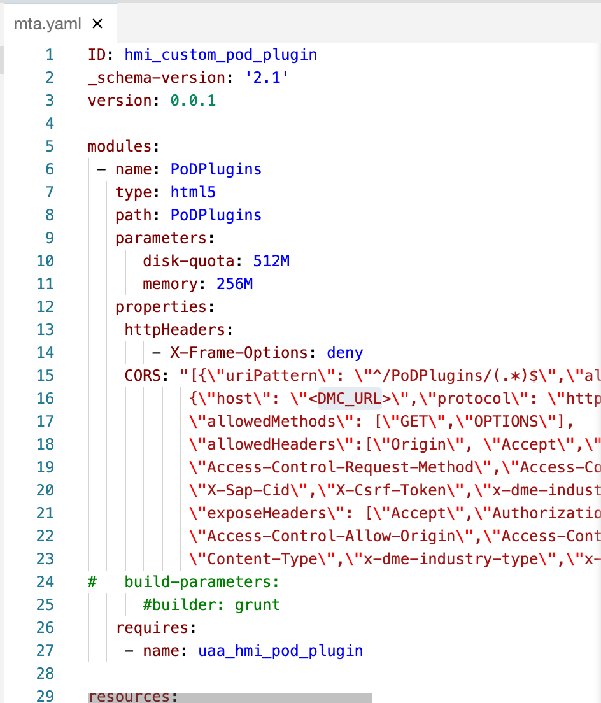

``` 
DMC_URL(in sample): dmc-az-cons-training.test.execution.eu20.dmc.cloud.sap
```
2. Right click the mta.yaml and select 'Build MTA Proejct'

3. Verify there *mtar file generated under folder mta_archives
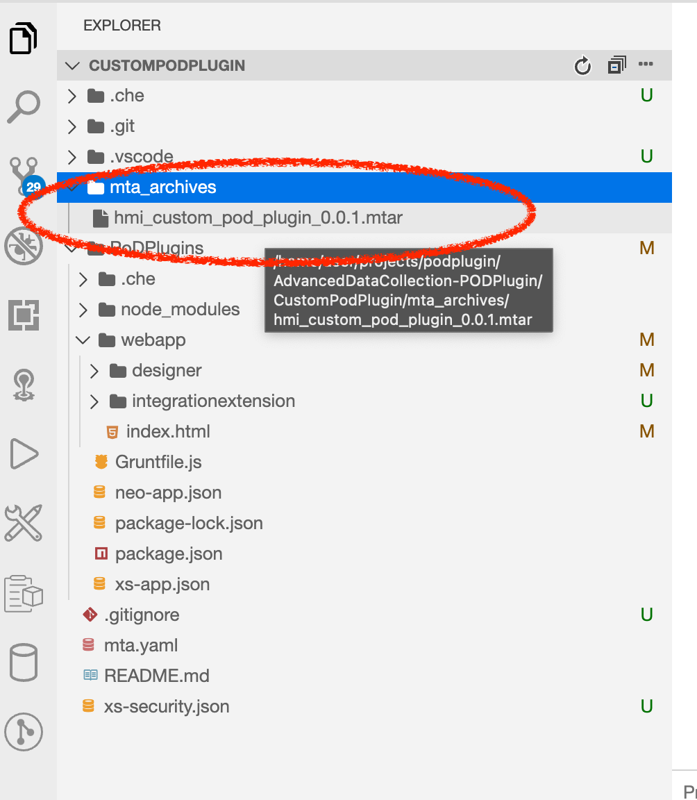
4. Login to Cloud Foundry from terminal by executing:
    - cf api your_api_endpoint (can be found as below from your DMC cockpit)
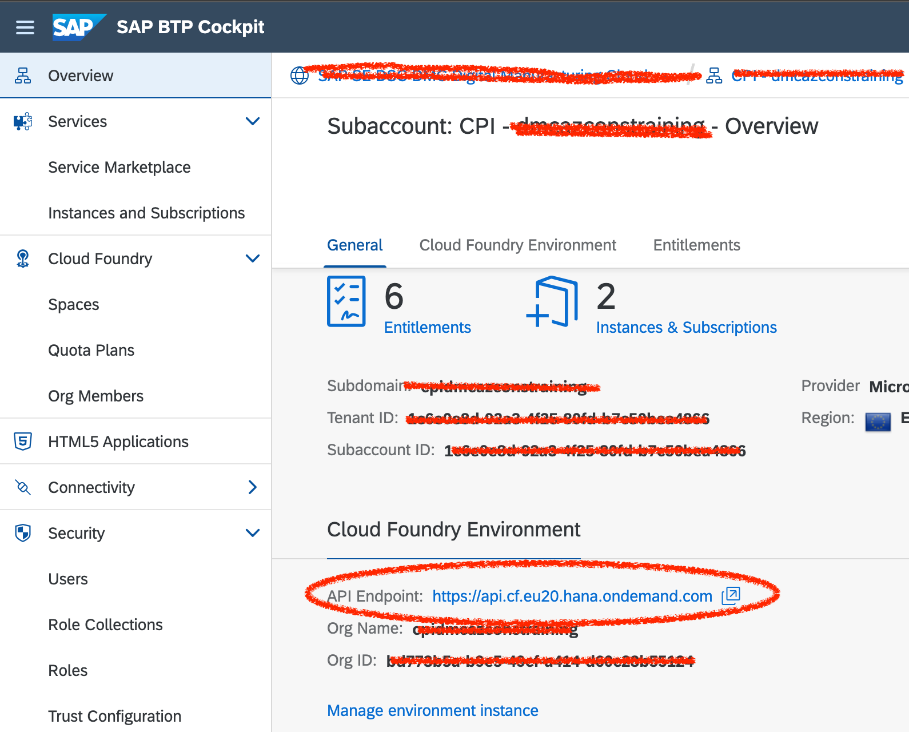
    - cf login
    - follow the command prompt to proceed
5. Right click the mtar file under folder mta_archives and select 'Deploy MTA Archive'
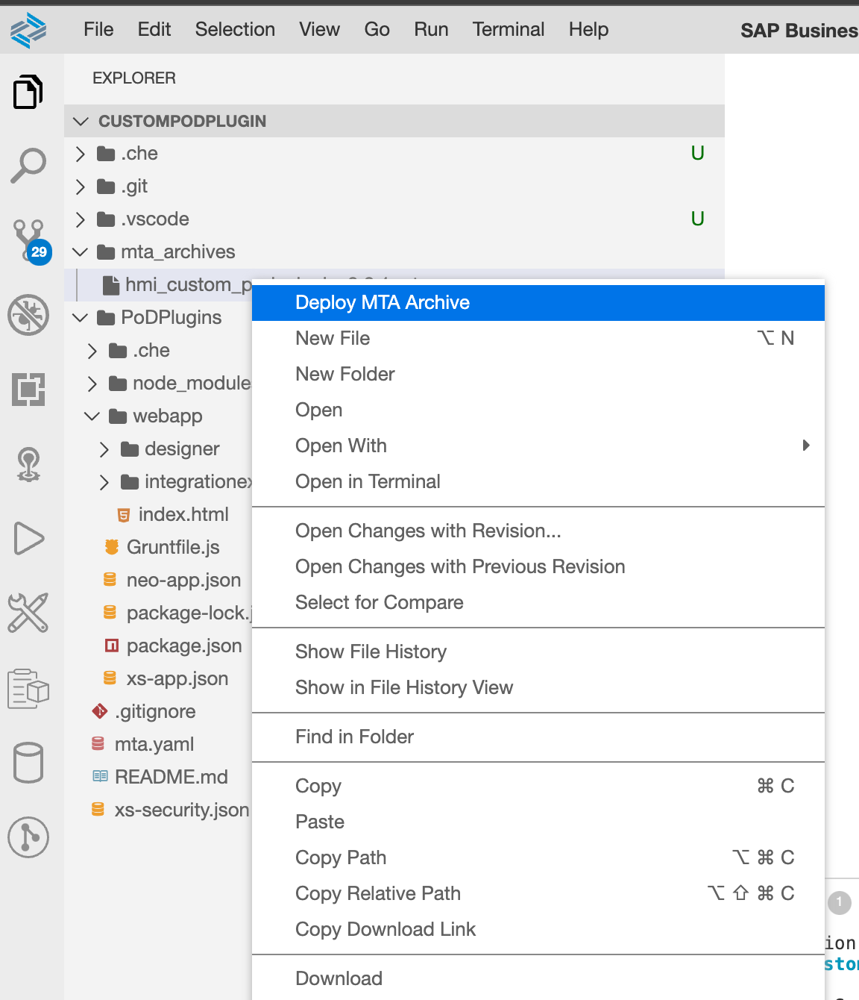
6. Wait for the process complete
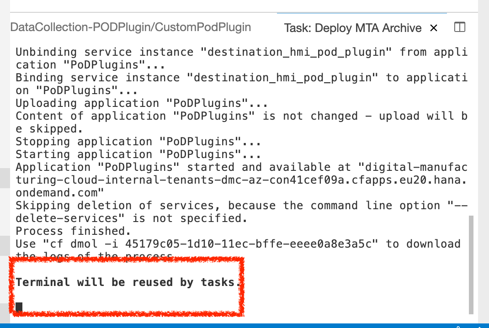

## Verify the deployment from sub account Cockpit
1. Login into your sub account in Cloud Foundry
2. Select the space you deployed your plugin application to
3. Find your application and click it

5. You will be able find informations about your application, like Start/Stop/Restart information from Events and application logs from Logs


[1]: https://help.sap.com/docs/SAP_DIGITAL_MANUFACTURING?task=develop_task
[2]: https://github.com/SAP-samples/digital-manufacturing-extension-samples.git

## Create Service Registry
1. Open app 'Manage Service Registry'
2. Switch to 'UI Extensions' tab and click 'Create'
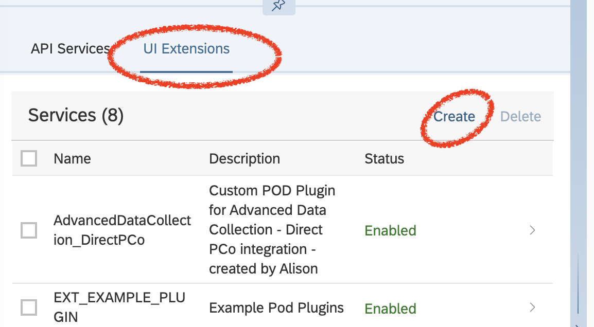
3. Input fields like below and save.
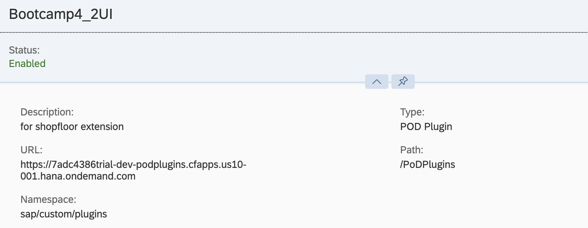
    URL: your application host url deployed in BTP

    Namespace: keep it same as your application(only replace '.' with '/')

    Path: the folder name that contains webapp and *json files

## Add your plugin into customized POD
1. Login to your DMC tenant
2. Open app POD Designer
3. Open a POD you want to edit or copy from
4. Select your plugin from the Plugins, drag and drop to an plugin container(Shopfloor Extension)
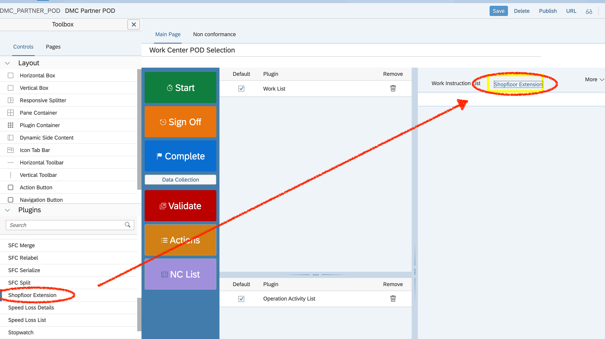
5. Config the plugin
    - Click the config button, and config values you exposed from the PropertyEditor.js
    - ApplicationUrl is the host of your Kyma service: 
    ```
    https://node.fe160ce.kyma.ondemand.com
    ```
    - ExecutionPath is the service path you save sfc based personnel info and variance reason code: 
    ```
    api/v1/sfc
    ```
    - PersonnelInfoPath is the service path you get configed personnel info for logged in user
    ```
    api/v1/user
    ```
    - SalesOrderField is the field created in app 'Manage Custom Data' for sales order
    ```
    CD_SALES_ORDER_ID
    ```
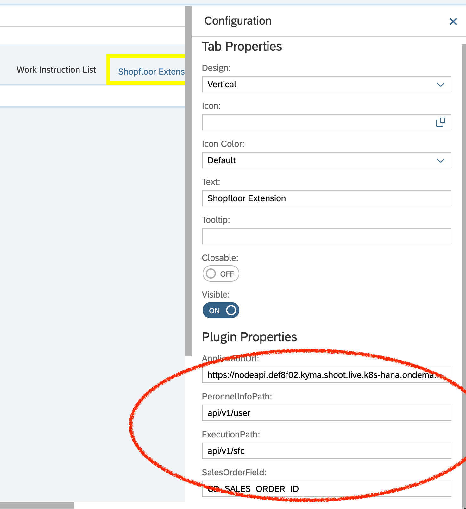
6. Save amd click preview button to preview your POD
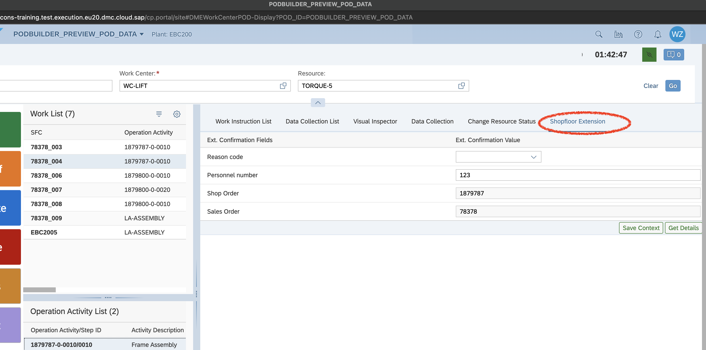
7. Add other components into POD to meet your requirements
8. Save and publish the POD when design is done


